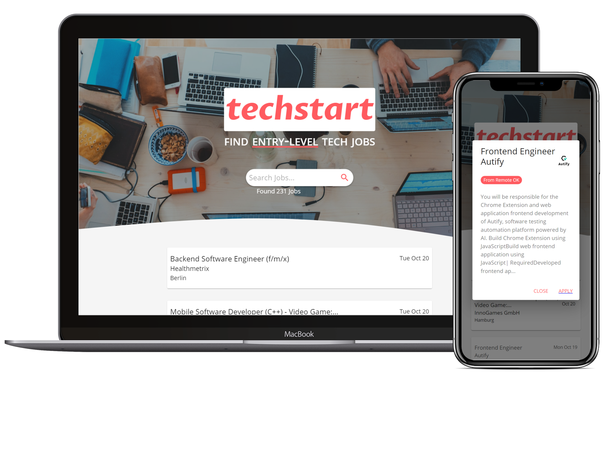

# TechStart | React Job Board :rocket: :man_technologist: :woman_technologist:

> A full-stack web app to collect and filter entry-level tech jobs from several external job sites.




**Check out TechStart [here](https://app.harveyreynier.com), where its deployed and constantly updated with the latest jobs!**

---


Built with several tools, most notably:

- [React](https://github.com/facebook/react)
- [Create React App](https://github.com/facebook/create-react-app)
- [Express](https://expressjs.com/)
- [Material-UI](https://github.com/mui-org/material-ui)
- [Node Redis](https://github.com/NodeRedis/node-redis)
- [Cron](https://github.com/node-cron/node-cron)

## What does this app do?

The *primary motivation* of this app was to **streamline the job search process** for graduates, students, and others seeking entry-level jobs in the tech industry.
There are several job board sites out there, and I personally found it difficult to navigate between them to find suitable jobs to apply for.
I hope that as I continue to develop this app and add more sources that I can help job-seekers break into the tech industry easier.

## Disclaimer
- :construction_worker: This app is a work in-progress.
- :bug: There may be bugs, feel free to report any by adding an issue!

## Setup
> To get a development instance of this application up and running...

**Ensure that NPM/Yarn and Node is installed on your machine.**

1. Clone this repository to your local machine.
2. Navigate to the `client` folder in your terminal, and run the following code:
    ````bash
    yarn install
    ````
3. Navigate back to the root folder, and run the following: 
    ````bash
    npm install
    ````
4. Navigate to the `worker` folder and start it's script:
    ````bash
    node index.js
    ````
5. In **another** terminal instance, navigate to the `api` folder and also start it's script:
    ````bash
    node index.js
    ````
6. Now that your backend is running, open **another** terminal instance, and navigate to the `client` folder and run:
    ````bash
    yarn start
    ````
7. **Done** Your browser should open the development site at `localhost:3000/` where you should see the jobs fetched through the backend.

**Enjoy!**

The application is also deployed and constantly updated [here](https://app.harveyreynier.com) using the [Google Cloud Platform](https://cloud.google.com/).


## Contributing

> There are several features that I still want to add and any contributions are welcome!

**To get started contributing...**

### Step 1

- **Option 1**
    - 🍴 Fork this repo!

- **Option 2**
    - 👯 Clone this repo to your local machine using `https://github.com/hreynier/job-board.git`

### Step 2

- **HACK AWAY!** 🔨🔨🔨

### Step 3

- 🔃 Create a new pull request using <a href="https://github.com/hreynier/job-board/compare/" target="_blank">`https://github.com/hreynier/job-board/compare/`</a>.

## Future Goals

There are several features that I aspire to add to this application, most notably:
- [ ] **Add several more external job sites**
- [ ] **Implement advanced filtering techniques** (e.g. filters based on locations, job types, etc.)
- [ ] **Add futher interaction with user accounts, saved jobs, lists etc.**

The current deployed application is definetly the minimum viable product and as such these features offer several routes to expand and develop the application further.
If you want to be involved in anyway, please dm me and we can discuss development!